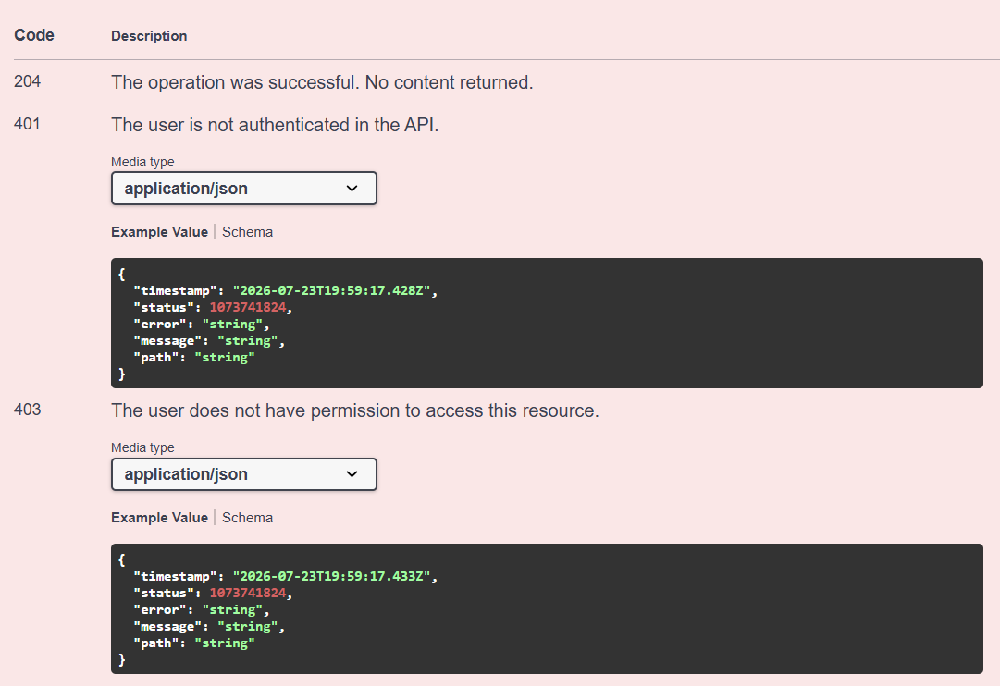

    <p></p>
    <p align="center">
    
    
    <a href="https://central.sonatype.com/artifact/io.github.docflow-lib/docflow-spring-boot-starter">
    
      </a>
   </p>

[//]: # (    <p align="center">)

[//]: # (        )

[//]: # (    </p>)

<p align="center">🧠 A smart, automated way to document your Spring Boot APIs.
</p>

---

# 📦 Choose Your Version

| **DocFlow** | **Spring Boot** |  **Java**  |   **Status**    |
|:-----------:|:---------------:|:----------:|:---------------:|
|    `3.x`    |     `4.x`   |   `17+`    | 🚀 Recommended  |
|    `2.x`    |    `3.4+`     |   `17+`    |   ✅ Supported   |
|    `1.x`    |    `3.4+`     |   `17+`    | 🛠️ Maintenance |

---

## 🚀 Installation

> **Choose the version that matches your Spring Boot version.**

### Spring Boot 4 (Recommended)

<table width="100%">
<tr>
<td valign="top" width="100%">

#### Maven
```xml
<dependency>
    <groupId>io.github.docflow-lib</groupId>
    <artifactId>docflow-spring-boot-starter</artifactId>
    <version>3.0.0</version>
</dependency>
```

#### Gradle
```groovy
implementation 'io.github.docflow-lib:docflow-spring-boot-starter:3.0.0'
```

</td>
</tr>
</table>

### Spring Boot 3

<table width="100%">
<tr>
<td valign="top" width="100%">

#### Maven
```xml
<dependency>
    <groupId>io.github.docflow-lib</groupId>
    <artifactId>docflow-spring-boot-starter</artifactId>
    <version>2.0.0</version>
</dependency>
```

#### Gradle
```groovy
implementation 'io.github.docflow-lib:docflow-spring-boot-starter:2.0.0'
```

</td>
</tr>
</table>

---

### Configuration

#### ⚙️ Configuration Properties

| Property | Description |
|-----------|-------------|
| docflow.title | OpenAPI title |
| docflow.description | OpenAPI description |
| docflow.version | API version |
| docflow.default-error-schema | Global error response DTO |
| docflow.security.enabled | Activate the security module (Spring Security). |
| docflow.security.scheme-name | Text that appears on the Swagger button |

Configure DocFlow using either application.yml or application.properties. Adjust the package names and paths according to your project. Choose your
preferred format below:

<table width="100%">
<tr>
<td valign="top" width="100%">

### Option A: Using `application.yml`
```yaml
springdoc:
  swagger-ui:
    path: /swagger-ui.html # Your custom Swagger UI URL path
  api-docs:
    path: /v3/api-docs     # Your custom OpenAPI JSON path

docflow:
  title: "Your API Title"
  description: "Your API Description"
  version: "1.0.0"
  default-error-schema: com.yourcompany.yourproject.exception.StandardError # Path to your global error DTO
```

### Option B: Using `application.properties`
```properties
# SpringDoc Setup
springdoc.swagger-ui.path=/swagger-ui.html
springdoc.api-docs.path=/v3/api-docs

# DocFlow Setup
docflow.title=Your API Title
docflow.description=Your API Description
docflow.version=1.0.0
docflow.default-error-schema=com.yourcompany.yourproject.exception.StandardError
```

</td>
</tr>
</table>

---

## 🚀 Introduction

DocFlow is a convention-based OpenAPI documentation library for Spring Boot.

It automatically generates endpoint summaries, descriptions, HTTP responses, security documentation and other OpenAPI metadata, allowing you to write less boilerplate while keeping your API documentation clean and consistent.

---

## 💡 Why DocFlow?

Most Spring Boot projects repeat the same OpenAPI annotations across controllers.

DocFlow eliminates that repetition by generating documentation through conventions and smart inference, letting developers focus on business logic instead of Swagger maintenance.

---

## 💥 Problem & Solution

Traditional Swagger documentation often results in verbose controllers or duplicated interfaces created only to hold annotations.

DocFlow replaces this repetitive configuration with convention-based documentation, producing cleaner controllers and professional OpenAPI documentation automatically.

<table width="100%">
<tr>
<td valign="top" width="50%">

### ❌ Before (Standard Swagger/OpenAPI)

Excessive boilerplate, cluttered endpoints, and poor readability.


</td>
<td valign="top" width="50%">

### ✨ After (With DocFlow)

Clean code, zero boilerplate, and automatic documentation based on conventions.


</td>
</tr>
</table>

---

## ✨ Features

<table width="100%">
<tr>
<td valign="top" width="33%">

### 🤖 Documentation

| Feature | Status |
| :--- | :---: |
| Zero-annotation documentation | ✅ |
| Automatic controller tags | ✅ |
| Automatic endpoint summaries | ✅ |
| Automatic endpoint descriptions | ✅ |
| Convention-based OpenAPI generation | ✅ |

</td>
<td valign="top" width="33%">

### ⚙️ OpenAPI

| Feature | Status |
| :--- | :---: |
| Automatic HTTP response generation | ✅ |
| Smart response code filtering | ✅ |
| Improved return type inference | ✅ |
| Cleaner generated OpenAPI specification | ✅ |
| Improved customization support | ✅ |
| Automatic response schema inference | ✅ |

</td>
<td valign="top" width="33%">

### 🌍 Internationalization

| Feature         | Status |       Feature       | Status |
|:----------------| :---: |:-------------------:| :------: |
| Arabic (AR)      | ✅ |    Italian (IT)     | ✅ |
| Chinese (CN)      | ✅ |    Japanese (JP)    | ✅ |
| Dutch (NL)      | ✅ |     Korean (KR)     | ✅ |
| English (EN)      | ✅ |   Portuguese (BR)   | ✅ |
| French (FR)      | ✅ |    Russian (RU)     | ✅ |
| German (DE)      | ✅ |    Spanish (ES)     | ✅ |

</td>
</tr>
</table>

---

## 🚀 Sample Projects

To help you get started quickly, we provide complete, functional, and verified sample applications for both build tools. You can explore the source code to see DocFlow in action:

### Spring Boot 4 (Recommended)

| Build Tool | Project Link                                                        | Key Features Demonstrated                                                 |
| :--- |:--------------------------------------------------------------------|:--------------------------------------------------------------------------|
| **Maven** 🛠️ | [docflow-maven-sample](examples/spring-boot-4/docflow-maven-sample) | Spring Boot 4.0.0+, Spring Security, Automated Swagger OpenAPI generation |
| **Gradle** 🐘 | [docflow-gradle-sample](examples/spring-boot-4/docflow-gradle-sample)             | Multi-platform build integration, Zero-Config documentation routing       |

### How to run the samples:
1. Clone this repository.
2. Navigate to the desired sample folder (`examples/spring-boot-4/docflow-maven-sample` or `examples/spring-boot-4/docflow-gradle-sample`).
3. Run the application:
   * For Maven: `mvn spring-boot:run`
   * For Gradle: `./gradlew bootRun`
4. Access the interactive documentation at: [Click here](http://localhost:8080/swagger-ui.html) or [http://localhost:8080/swagger-ui.html](http://localhost:8080/swagger-ui.html)

---

### Spring Boot 3

| Build Tool | Project Link                                                        | Key Features Demonstrated |
| :--- |:--------------------------------------------------------------------| :--- |
| **Maven** 🛠️ | [docflow-maven-sample](examples/spring-boot-3/docflow-maven-sample) | Spring Boot 3.4.0+, Spring Security, Automated Swagger OpenAPI generation |
| **Gradle** 🐘 | [docflow-gradle-sample](examples/spring-boot-3/docflow-gradle-sample)            | Multi-platform build integration, Zero-Config documentation routing |

### How to run the samples:
1. Clone this repository.
2. Navigate to the desired sample folder (`examples/spring-boot-3/docflow-maven-sample` or `examples/spring-boot-3/docflow-gradle-sample`).
3. Run the application:
   * For Maven: `mvn spring-boot:run`
   * For Gradle: `./gradlew bootRun`
4. Access the interactive documentation at: [Click here](http://localhost:8080/swagger-ui.html) or [http://localhost:8080/swagger-ui.html](http://localhost:8080/swagger-ui.html)

---

## 🛠️ Quick Start

DocFlow works out of the box! Just add the dependency, and your standard Spring Boot controllers are automatically documented based on conventions.

### ⚡ Automatic Documentation

<table width="100%">
<tr>
<td valign="top" width="100%">

#### Code

```java
@RestController
@RequestMapping("/users")
public class UserController {

    @PostMapping
    public ResponseEntity<UserResponse> createNewUser(@RequestBody UserCreateDTO request) {
        return ResponseEntity.status(HttpStatus.CREATED)
                .body(service.create(request));
    }
}
```

#### Result


</td>
</tr>
</table>

---

### 🎛️ Customize Generated Documentation

DocFlow generates OpenAPI documentation automatically using conventions.

Use the `@ApiDoc` annotation only when you need to customize the generated documentation for a specific endpoint.

---

### Supported Attributes

| Attribute | Description |
| :--- | :--- |
| `exclude` | Excludes one or more automatically generated HTTP status codes from the endpoint documentation. |

### Example

<table width="100%">
<tr>
<td valign="top" width="100%">

#### Code

```java
@RestController
@RequestMapping("/users")
public class UserController {

    @DeleteMapping("/{id}")
    @PreAuthorize("hasRole('ADMIN')")
    @ApiDoc(exclude = {
            HttpStatus.NOT_FOUND,
            HttpStatus.INTERNAL_SERVER_ERROR
    })
    public ResponseEntity<Void> delete(@PathVariable Long id) {
        return ResponseEntity.noContent().build();
    }
}
```

#### Result



</td>
</tr>
</table>

---

## 📋 Supported HTTP Status Codes

DocFlow automatically generates the most common HTTP responses according to the endpoint type. Any of these responses can be excluded using the `exclude` attribute.

| HTTP Status | Description | `HttpStatus` Constant |
| :---: | :--- | :--- |
| `200 OK` | Successful request | `HttpStatus.OK` |
| `201 Created` | Resource successfully created | `HttpStatus.CREATED` |
| `204 No Content` | Successful request without response body | `HttpStatus.NO_CONTENT` |
| `400 Bad Request` | Invalid request | `HttpStatus.BAD_REQUEST` |
| `401 Unauthorized` | Authentication required | `HttpStatus.UNAUTHORIZED` |
| `403 Forbidden` | Access denied | `HttpStatus.FORBIDDEN` |
| `404 Not Found` | Resource not found | `HttpStatus.NOT_FOUND` |
| `409 Conflict` | Resource conflict | `HttpStatus.CONFLICT` |
| `422 Unprocessable Entity` | Validation failed | `HttpStatus.UNPROCESSABLE_ENTITY` |
| `500 Internal Server Error` | Unexpected server error | `HttpStatus.INTERNAL_SERVER_ERROR` |

### Example

```java
@ApiDoc(exclude = {
        HttpStatus.NOT_FOUND,
        HttpStatus.INTERNAL_SERVER_ERROR
})
```

---

## 📜 License
<p>
<a href="LICENSE">

</a>
</p>

---

## ⭐ Support
If DocFlow helps your project, consider giving it a star on GitHub.

---

## ✍️ Author
<p align="left">
<b>Mateus Silva</b> <br>
<a href="https://github.com/mateus-silva-dev" target="_blank"></a>
<a href="https://www.linkedin.com/in/devmateussilva/" target="_blank"></a>
</p>