    <p></p>
    <p align="center">
    
    
    
    
   </p>

[//]: # (    <p align="center">)

[//]: # (        )

[//]: # (    </p>)

<p align="center">🧠 A smart, automated way to document your Spring Boot APIs.
</p>

---

## 📚 Table of Contents

- [🔧 Compatibility](#-compatibility)
- [🚀 Introduction](#-introduction)
- [💡 Why DocFlow?](#-why-docflow)
- [💥 Problem & 🌱 The Solution](#-problem--the-solution)
- [🎯 Features](#-features)
- [🛠️ Installation](#️-installation)
- [🚀 Sample Projects](#-sample-projects)
- [⚡ Quick Start](#-quick-start)
- [🏷️ Annotations & Supported HTTP Status Codes](#️-annotations--supported-http-status-codes)
- [🔒 Smart Security (JWT Authentication)](#-smart-security-smart-jwt-authentication)
- [🌐 Internationalization (i18n)](#-internationalization-i18n)
- [🗺️ Roadmap](#️-roadmap)
- [📜 License](#-license)
- [⭐ Support](#-support)
- [✍️ Author](#️-author)

---

## 🔧 Compatibility

| Component | Supported Version |
| :--- |:------------------|
| **Java** | `17+`             |
| **Spring Boot** | `3.4.0+`          |

> ✅ Tested on Spring Boot 3.4.x, 3.5.x and 4.0.0.
>
> ❌ Versions prior to Spring Boot 3.4.0 are not supported.

---

## 🚀 Introduction
DocFlow is a SpringDoc OpenAPI support library that simplifies endpoint documentation by automating
summaries and descriptions and standardizing error schemes. With native support for internationalization (i18n),
DocFlow allows your API to communicate with the world in multiple languages without any extra effort.

DocFlow eliminates the need to write repetitive text in OpenAPI annotations. Through automatic inferences and
custom annotations, you keep your code clean and your Swagger documentation professional, following industry
best practices.

---

## Why DocFlow?

DocFlow was created to solve three common problems in Spring Boot APIs:

- Excessive Swagger/OpenAPI boilerplate
- Repetitive HTTP response documentation
- Lack of standardized documentation across projects

By leveraging conventions and automation, DocFlow allows developers to focus on business logic instead of documentation maintenance.

---

## 💥 Problem & 🌱 The Solution

Have you ever felt like you’re writing more Swagger annotations than business logic? Excessive OpenAPI configuration wastes time and undermines the readability of your Java code. The common workaround of creating an interface just to “hide” the annotations from the controller is a stopgap that creates another problem: an explosion of duplicate files in your project.

<table width="100%">
<tr>
<td valign="top" width="50%">

### ❌ Before (Standard Swagger/OpenAPI)

Excessive boilerplate, cluttered endpoints, and poor readability.

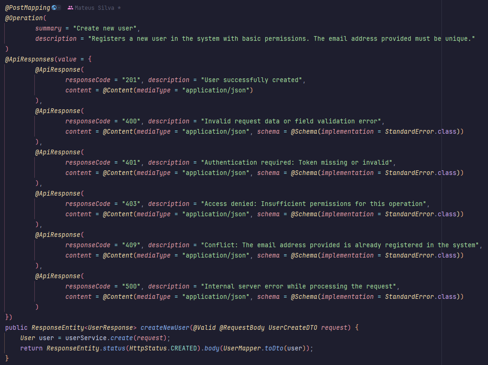

</td>
<td valign="top" width="50%">

### ✨ After (With DocFlow)

Clean code, zero boilerplate, and automatic documentation based on conventions.

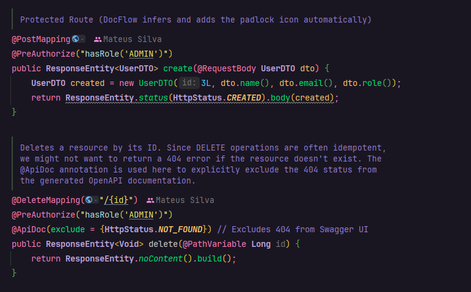

</td>
</tr>
</table>

---

## 🎯 Features
* **Reduced Swagger Boilerplate:** Say goodbye to endless annotations cluttering your controllers.
* **Automatic OpenAPI Documentation:** Generates full, compliant OpenAPI specs seamlessly.
* **Smart Security Inference:** Automatically reads Spring Security annotations (e.g., `@PreAuthorize`) to secure endpoints.
* **Zero-Config JWT Auth:** Instantly configures Bearer token authentication in Swagger UI without manual schemas.
* **Smart HTTP Response Inference:** Automatically detects and maps your endpoint response types.
* **Automatic 200 / 204 Detection:** Smart recognition of content return vs. empty success statuses.
* **Convention-Based Descriptions:** Generates clear, human-readable endpoint documentation by default.
* **Spring Boot Auto-Configuration:** Plug-and-play setup with zero manual bean configuration required.
* **Flexible YAML Configuration:** Easily customize global behaviors and metadata via `application.yml`.
* **OpenAPI Schema Customization:** Fully extend, override, or tweak generated schemas when needed.

---

## 🛠️ Installation
### 1. Add Dependency
Add the **DocFlow** starter to your project configuration:

<table width="100%">
<tr>
<td valign="top" width="100%">

#### Maven
```xml
<dependency>
    <groupId>io.github.docflow-lib</groupId>
    <artifactId>docflow-spring-boot-starter</artifactId>
    <version>1.0.0</version>
</dependency>
```

#### Gradle
```groovy
implementation 'io.github.docflow-lib:docflow-spring-boot-starter:1.0.0'
```

</td>
</tr>
</table>

---

### 2. Configuration

#### ⚙️ Configuration Properties

| Property | Description |
|-----------|-------------|
| docflow.title | OpenAPI title |
| docflow.description | OpenAPI description |
| docflow.version | API version |
| docflow.default-error-schema | Global error response DTO |
| docflow.security.enabled | Activate the security module (Spring Security). |
| docflow.security.scheme-name | Text that appears on the Swagger button |

Configure your project properties by adjusting the paths and packages to match your own project structure. Choose your
preferred format below:

<table width="100%">
<tr>
<td valign="top" width="100%">

### Option A: Using `application.yml`
```yaml
springdoc:
  swagger-ui:
    path: /swagger-ui.html # Your custom Swagger UI URL path
  api-docs:
    path: /v3/api-docs     # Your custom OpenAPI JSON path
  packages-to-scan: com.yourcompany.yourproject.controller # Package where your controllers are located
  remove-broken-reference-definitions: false

docflow:
  title: "Your API Title"
  description: "Your API Description"
  version: "1.0.0"
  default-error-schema: com.yourcompany.yourproject.exception.StandardError # Path to your global error DTO
```

### Option B: Using `application.properties`
```properties
# SpringDoc Setup
springdoc.swagger-ui.path=/swagger-ui.html
springdoc.api-docs.path=/v3/api-docs
springdoc.packages-to-scan=com.yourcompany.yourproject.controller
springdoc.remove-broken-reference-definitions=false

# DocFlow Setup
docflow.title=Your API Title
docflow.description=Your API Description
docflow.version=1.0.0
docflow.default-error-schema=com.yourcompany.yourproject.exception.StandardError
```

</td>
</tr>
</table>

---

## 🚀 Sample Projects

To help you get started quickly, we provide complete, functional, and verified sample applications for both build tools. You can explore the source code to see DocFlow in action:

| Build Tool | Project Link | Key Features Demonstrated |
| :--- | :--- | :--- |
| **Maven** 🛠️ | [docflow-maven-sample](examples/docflow-maven-sample) | Spring Boot 3.4.0+, Spring Security, Automated Swagger OpenAPI generation |
| **Gradle** 🐘 | [docflow-gradle-sample](examples/docflow-gradle-sample) | Multi-platform build integration, Zero-Config documentation routing |

### How to run the samples:
1. Clone this repository.
2. Navigate to the desired sample folder (`examples/docflow-maven-sample` or `examples/docflow-gradle-sample`).
3. Run the application:
    * For Maven: `mvn spring-boot:run`
    * For Gradle: `./gradlew bootRun`
4. Access the interactive documentation at: [Click here](http://localhost:8080/swagger-ui.html) or [http://localhost:8080/swagger-ui.html](http://localhost:8080/swagger-ui.html)


---

## Quick Start
**Docflow** offers two flexible ways to document your methods: **automatic** and **manual**.

### 1. Automatic Mode
In this mode, you just need to enter the annotation. Docflow automatically generates the information based on the method name.

<table width="100%">
<tr>
<td valign="top" width="100%">

#### Code:
```java
@RestController
@RequestMapping("/users")
@ApiDocController // <- DocFlow Annotations
public class UserController {

    @PostMapping
    @ApiDocPost // <- DocFlow Annotations
    public ResponseEntity<UserResponse> createNewUser(@RequestBody UserCreateDTO request) {
        return ResponseEntity.status(HttpStatus.CREATED).body(service.create(request));
    }
}
```

#### Result:
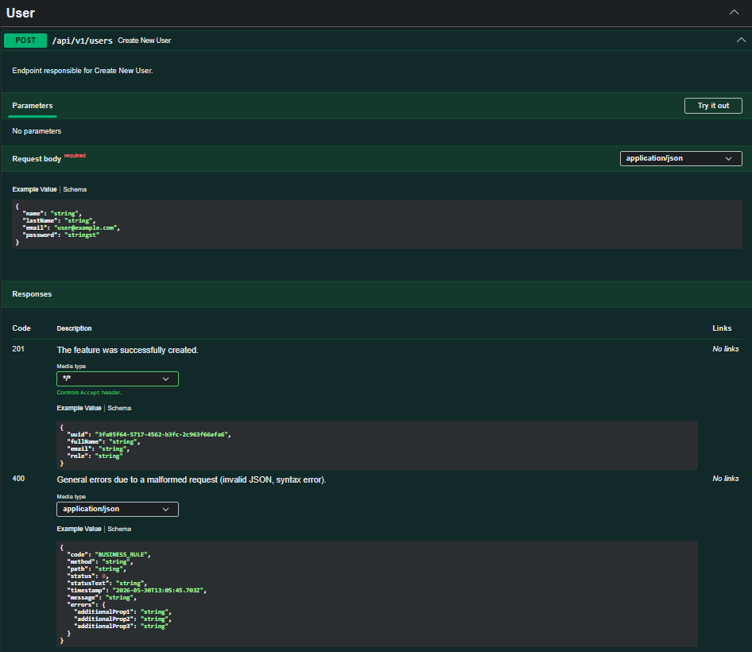

</td>
</tr>
</table>

### 2. Manual Mode
If you need more details or a customized description, you can enter the information directly in the note.

<table width="100%">
<tr>
<td valign="top" width="100%">

#### Code:
```java
@RestController
@RequestMapping("/users")
@ApiDocController(
        tagName = "Users",                              // Optional
        tagDescription = "User management endpoints"    // Optional
)
public class UserController {

    @PostMapping
    @ApiDocPost(
            summary = "Create a new user",                                              // Optional
            description = "Registers a new user in the system with basic permissions."  // Optional
    )
    public ResponseEntity<UserResponse> createNewUser(@RequestBody UserCreateDTO request) {
        return ResponseEntity.status(HttpStatus.CREATED).body(service.create(request));
    }
}
```

#### Result:
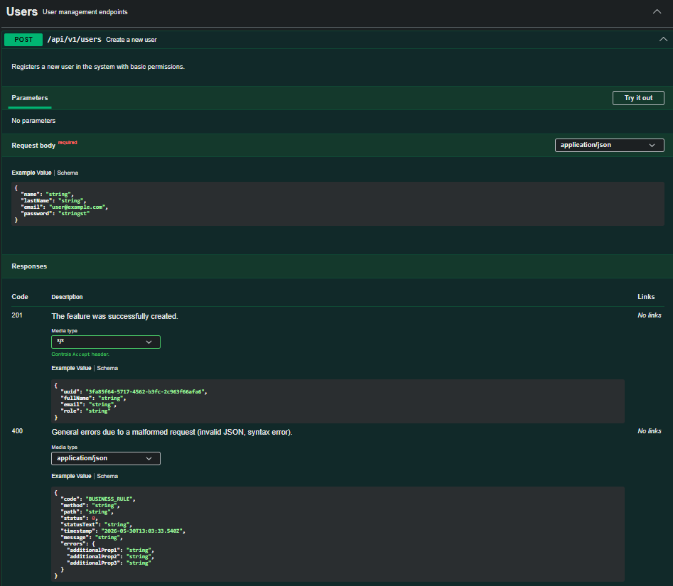

</td>
</tr>
</table>

---

## 🏷️ Annotations & Supported HTTP Status Codes

| Note | HTTP Method | Standard HTTP Codes | Status Description |
| :--- | :--- | :--- | :--- |
| **`@ApiDocGet`** | `GET` | 200, 401, 403, 404, 500 | Success (OK), Unauthorized, Forbidden, Not Found, Internal Error. |
| **`@ApiDocPost`** | `POST` | 201, 400, 401, 403, 409, 422, 500 | Created, Invalid Request, Unauthorized, Forbidden, Conflict, Unprocessable Entity, Internal Error. |
| **`@ApiDocPut`** / **`@ApiDocPatch`** | `PUT` / `PATCH` | 200/204, 400, 401, 403, 404, 422, 500 | Success/No Content, Invalid Request, Unauthorized, Forbidden, Not Found, Unprocessable Entity, Internal Error. |
| **`@ApiDocDelete`** | `DELETE` | 204, 401, 403, 404, 500 | No Content, Unauthorized, Forbidden, Not Found, Internal Error. |


### 📑 Quick Annotation Guide
| Annotation | Where to apply? | When to use? |
| :--- | :--- | :--- |
| **`@ApiDocController`** | On the Controller class | In classes annotated with `@RestController` or `@Controller`. |
| **`@ApiDocGet`** | On the method | In HTTP `GET` methods (`@GetMapping`). |
| **`@ApiDocPost`** | On the method | In HTTP `POST` methods (`@PostMapping`). |
| **`@ApiDocPut`** | On the method | In HTTP `PUT` methods (`@PutMapping`). |
| **`@ApiDocPatch`** | On the method | In HTTP `PATCH` methods (`@PatchMapping`). |
| **`@ApiDocDelete`** | On the method | In HTTP `DELETE` methods (`@DeleteMapping`). |

---

## 🔒 Smart Security (Smart JWT Authentication)

**DocFlow** features a security inference engine that draws the padlocks in Swagger and creates the Login button automatically, **without cluttering your code with verbose OpenAPI annotations**.

Just turn on security in your `application.yml/.properties`. The library natively configures the Bearer Token (JWT) format:

### 1. With the module active

<table width="100%">
<tr>
<td valign="top" width="100%">

#### configuration .yml:
```yml
docflow:
  security:
    enabled: true
    scheme-name: "API Authentication"   # Optional: Text that appears on the Swagger button
```

#### configuration .properties:
```properties
docflow.security.enabled=true
docflow.security.scheme-name=API Authentication     # Optional: Text that appears on the Swagger button
```

#### Code:
```java
// 🔓 Free Route: DocFlow notices the lack of annotations and leaves the documentation public.
@GetMapping
public List<User> list() { ... }

// 🔒 Protected Route: DocFlow detects @PreAuthorize and places the padlock automatically!
@PostMapping
@PreAuthorize("hasRole('ADMIN')")
public User create() { ... }
```

#### Result:
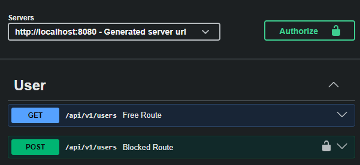

#### scheme-name:
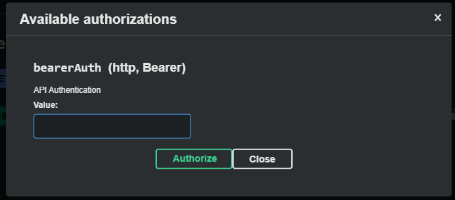

</td>
</tr>
</table>

### 2. With the module disabled

<table width="100%">
<tr>
<td valign="top" width="30%">

#### configuration .yml:
```yml
docflow:
  security:
    enabled: false
    scheme-name: "API Authentication"   # Optional: Text that appears on the Swagger button
```

#### configuration .properties:
```properties
docflow.security.enabled=false
docflow.security.scheme-name=API Authentication     # Optional: Text that appears on the Swagger button
```

#### Code:
```java
// 🔓 Free Route: DocFlow notices the lack of annotations and leaves the documentation public.
@GetMapping
public List<User> list() { ... }

// 🔒 Protected Route: DocFlow detects @PreAuthorize and places the padlock automatically!
@PostMapping
@PreAuthorize("hasRole('ADMIN')")
public User create() { ... }
```

#### Result:
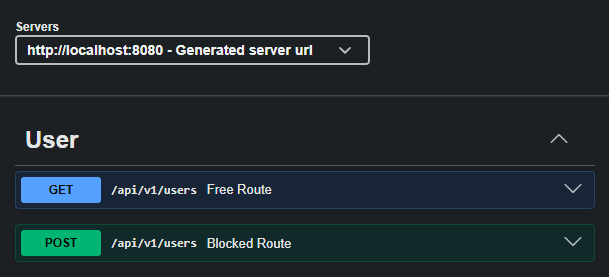

</td>
</tr>
</table>

---

## 🌐 Internationalization (i18n)

One of **DocFlow's** most powerful features is its native multi-language support. The documentation dynamically adapts based on the user's browser language context.

By default, if a language is not specified or supported, it fallbacks to **English**.

### Supported Languages & Swagger Preview

<table width="100%">
<tr>
<td valign="top" width="30%">

| Language | Flag | Status | Preview                                                                    |
| :--- | :---: | :---: |:---------------------------------------------------------------------------|
| **English** |  | Default | 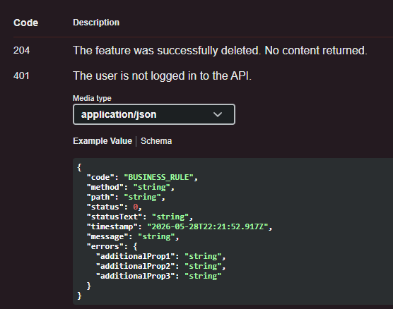    |
| **Portuguese** |  | Supported |  |
| **Spanish** |  | Supported | 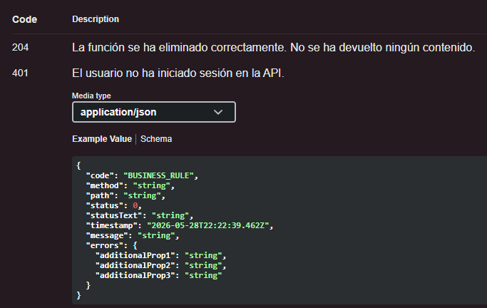    |
</td>
<td valign="top" width="30%">

| Language                 | Flag | Status | Preview                                                                 |
|:-------------------------| :---: | :---: |:------------------------------------------------------------------------|
| **French**               |  | Supported | 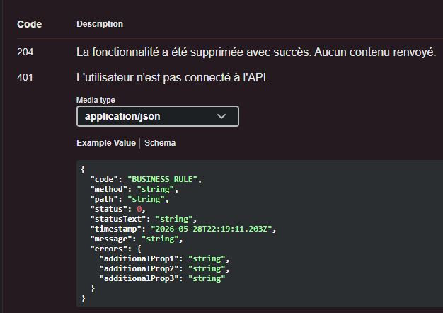  |
| **German**               |  | Supported | 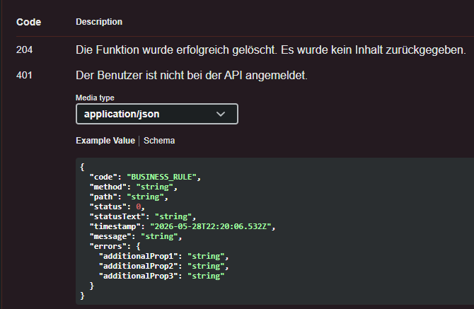  |
| **Chinese (Simplified)** |  | Supported | 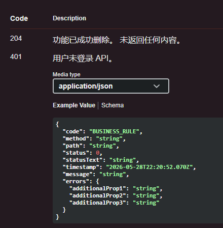 |

</td>
</tr>
</table>

No extra configuration is required. DocFlow automatically detects the `Accept-Language` headers and translates the standard error descriptions on the fly.

---

# 🗺️ Roadmap

---

## 🚀 Version 1.0.0 — Initial Release (Released)

<table width="100%">
<tr>
<td valign="top" width="33%">

### 💎 Core & Automation


| Feature / Task | Status |
| :--- |:------:|
| Simplified OpenAPI annotations |   ✅    |
| `@ApiDocController` support |   ✅    |
| Automatic summary generation |   ✅    |
| Automatic description generation |   ✅    |
| Convention-over-configuration |   ✅    |
| Automatic HTTP response doc |   ✅    |
| Smart Security inference |   ✅    |
| Zero-Config JWT Auth |   ✅    |

</td>
<td valign="top" width="33%">

### 🧠 Smart Response & Compatibility


| Feature / Task | Status |
| :--- | :---: |
| Auto `200`, `201`, `204` detection | ✅ |
| Return type inspection | ✅ |
| Support: DTO & `List<T>` | ✅ |
| Support: `Page<T>` & `Slice<T>` | ✅ |
| Support: `Optional<T>` & `Map` | ✅ |
| Support: `String`, `URI` & `Void` | ✅ |

</td>
<td valign="top" width="33%">

### ⚙️ Configuration & i18n


| Feature / Task | Status |
| :--- | :---: |
| YAML & Properties support | ✅ |
| OpenAPI metadata configuration | ✅ |
| Configurable default error schema | ✅ |
| Automatic browser locale detection | ✅ |
| Support: EN, PT, ES, FR, DE, CN | ✅ |
| Maven example project | ✅ |
| Gradle example project | ✅ |

</td>
</tr>
</table>

---

## ⚡ Version 1.1.0 — DX, OpenAPI & i18n Expansion

<table width="100%">
<tr>
<td valign="top" width="33%">

### 🛠️ DX & Refinements


| Feature / Task | Status |
| :--- | :---: |
| Improved README documentation | ⏳ |
| More customization examples | ⏳ |

</td>
<td valign="top" width="33%">

### 🔍 OpenAPI Improvements


| Feature / Task | Status |
| :--- | :---: |
| Additional customization hooks | ⏳ |
| Custom response description overrides | ⏳ |
| Better generated descriptions | ⏳ |

</td>
<td valign="top" width="33%">

### 🌍 i18n Expansion


| Feature / Task | Status |
| :--- | :---: |
| Support: Italian (IT) | ⏳ |
| Support: Japanese (JP) | ⏳ |
| Support: Korean (KR) | ⏳ |
| Support: Russian (RU) | ⏳ |

</td>
</tr>
</table>

---

## 🔮 Version 2.0.0 — The Convention Era

<table width="100%">
<tr>
<td valign="top" width="50%">

### 🤖 Convention-Based Docs


| Feature / Task | Status |
| :--- | :---: |
| Full doc *without* annotations | 📅 |
| Spring Mapping inference | 📅 |
| Controller tag auto-generation | 📅 |
| Endpoint summary improvements | 📅 |

</td>
<td valign="top" width="50%">

### 🎛️ Configuration & Ecosystem


| Feature / Task | Status |
| :--- | :---: |
| Global response customization | 📅 |
| Custom conventions support | 📅 |
| Kotlin language support | 📅 |
| Expanded Spring ecosystem support | 📅 |

</td>
</tr>
</table>


---

## 📜 License
<p>
<a href="LICENSE">

</a>
</p>

---

## ⭐ Support
If DocFlow helps your project, consider giving it a star on GitHub.

---

## ✍️ Author
<p align="left">
<b>Mateus Silva</b> <br>
<a href="https://github.com/mateus-silva-dev" target="_blank"></a>
<a href="https://www.linkedin.com/in/devmateussilva/" target="_blank"></a>
</p>